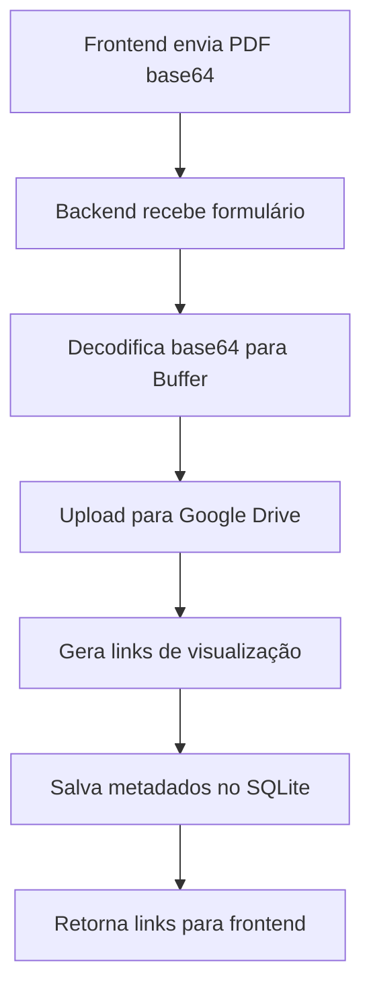

# 🔗 Integração Google Drive - Documentação Técnica

## 🎯 Visão Geral

Sistema completo de integração com **Google Drive API v3** para upload automático de arquivos PDF enviados através dos formulários. Inclui **autenticação por Service Account**, **organização automática de pastas** e **links públicos para visualização**.

## 🏗️ Arquitetura da Integração

### **Fluxo Completo**


### **Estrutura de Arquivos**
```
BACKENDCDG/
├── services/
│   └── googleDriveService.js     # Serviço principal
├── config/
│   └── service-account-key.json  # Chave de autenticação
└── controllers/
    └── formularioController.js   # Integração nos formulários
```

## 🔧 Configuração da Service Account

### **1. Criar Service Account no Google Cloud**

1. Acesse [Google Cloud Console](https://console.cloud.google.com/)
2. Crie um novo projeto ou selecione existente
3. Ative a **Google Drive API**
4. Vá em **IAM & Admin** → **Service Accounts**
5. Clique em **Create Service Account**
6. Preencha os dados:
   ```
   Nome: casa-da-grafica-drive
   Descrição: Service Account para uploads automáticos
   ```
7. Gere uma chave JSON e baixe
8. Salve como `config/service-account-key.json`

### **2. Configurar Permissões no Drive**

```javascript
// No Google Drive, compartilhe a pasta raiz com o email da Service Account
// Exemplo: casa-da-grafica-drive@projeto.iam.gserviceaccount.com
// Permissão: Editor
```

### **3. Variáveis de Ambiente**

```env
# .env
GOOGLE_SERVICE_ACCOUNT_KEY=./config/service-account-key.json
GOOGLE_DRIVE_FOLDER_ID=1ABC123DEF456...  # ID da pasta raiz
```

## 🚀 Implementação do Serviço

### **GoogleDriveService.js - Código Completo**

```javascript
// services/googleDriveService.js
const { google } = require('googleapis');
const { Readable } = require('stream');
const path = require('path');
const fs = require('fs');

class GoogleDriveService {
  constructor() {
    this.initializeAuth();
    this.drive = google.drive({ version: 'v3', auth: this.auth });
  }

  /**
   * Inicializa autenticação com Service Account
   */
  initializeAuth() {
    try {
      const keyPath = process.env.GOOGLE_SERVICE_ACCOUNT_KEY;
      
      if (!keyPath || !fs.existsSync(keyPath)) {
        throw new Error(`Service Account key não encontrada: ${keyPath}`);
      }

      this.auth = new google.auth.GoogleAuth({
        keyFile: keyPath,
        scopes: [
          'https://www.googleapis.com/auth/drive.file',
          'https://www.googleapis.com/auth/drive.readonly'
        ]
      });

      console.log('✅ Google Drive Auth inicializada com sucesso');
    } catch (error) {
      console.error('❌ Erro ao inicializar Google Drive Auth:', error);
      throw error;
    }
  }

  /**
   * Upload de arquivo para Google Drive
   * @param {Object} options - Opções do upload
   * @param {string} options.name - Nome do arquivo
   * @param {Buffer} options.buffer - Buffer do arquivo
   * @param {string} options.mimeType - MIME type do arquivo
   * @param {Array} options.parents - IDs das pastas pai
   * @returns {Promise<Object>} Dados do arquivo no Drive
   */
  async uploadFile({ name, buffer, mimeType, parents = [] }) {
    try {
      console.log(`📤 Iniciando upload: ${name} (${this.formatBytes(buffer.length)})`);

      // Criar stream do buffer
      const stream = Readable.from(buffer);

      // Upload para o Drive
      const response = await this.drive.files.create({
        requestBody: {
          name: name,
          parents: parents.length > 0 ? parents : [process.env.GOOGLE_DRIVE_FOLDER_ID]
        },
        media: {
          mimeType: mimeType,
          body: stream
        },
        fields: 'id,name,size,webViewLink,webContentLink,createdTime'
      });

      const fileData = response.data;

      // Configurar permissões públicas para visualização
      await this.setPublicPermissions(fileData.id);

      console.log(`✅ Upload concluído: ${name} (ID: ${fileData.id})`);

      return {
        id: fileData.id,
        name: fileData.name,
        size: parseInt(fileData.size),
        webViewLink: fileData.webViewLink,
        webContentLink: fileData.webContentLink,
        createdTime: fileData.createdTime,
        // Links diretos para embed
        directViewLink: `https://drive.google.com/file/d/${fileData.id}/view`,
        directDownloadLink: `https://drive.google.com/uc?id=${fileData.id}&export=download`
      };

    } catch (error) {
      console.error(`❌ Erro no upload de ${name}:`, error);
      throw new Error(`Falha no upload do arquivo: ${error.message}`);
    }
  }

  /**
   * Configurar permissões públicas para visualização
   * @param {string} fileId - ID do arquivo no Drive
   */
  async setPublicPermissions(fileId) {
    try {
      await this.drive.permissions.create({
        fileId: fileId,
        requestBody: {
          role: 'reader',
          type: 'anyone'
        }
      });

      console.log(`🔓 Permissões públicas configuradas para: ${fileId}`);
    } catch (error) {
      console.error(`❌ Erro ao configurar permissões para ${fileId}:`, error);
      // Não quebra o fluxo se falhar
    }
  }

  /**
   * Criar pasta no Google Drive
   * @param {string} name - Nome da pasta
   * @param {string} parentId - ID da pasta pai
   * @returns {Promise<Object>} Dados da pasta criada
   */
  async createFolder(name, parentId = null) {
    try {
      const response = await this.drive.files.create({
        requestBody: {
          name: name,
          mimeType: 'application/vnd.google-apps.folder',
          parents: parentId ? [parentId] : [process.env.GOOGLE_DRIVE_FOLDER_ID]
        },
        fields: 'id,name'
      });

      console.log(`📁 Pasta criada: ${name} (ID: ${response.data.id})`);
      return response.data;

    } catch (error) {
      console.error(`❌ Erro ao criar pasta ${name}:`, error);
      throw error;
    }
  }

  /**
   * Buscar ou criar estrutura de pastas organizadas
   * @param {string} escola - Nome da escola
   * @param {Date} data - Data para organização
   * @returns {Promise<string>} ID da pasta final
   */
  async getOrCreateFolderStructure(escola, data = new Date()) {
    try {
      const ano = data.getFullYear();
      const mes = String(data.getMonth() + 1).padStart(2, '0');
      const mesNome = this.getMonthName(data.getMonth());

      // Estrutura: Casa da Gráfica > Formulários > 2025 > 05-Maio > ZeroHum
      const estrutura = [
        { nome: 'Formulários', pai: process.env.GOOGLE_DRIVE_FOLDER_ID },
        { nome: ano.toString(), pai: null },
        { nome: `${mes}-${mesNome}`, pai: null },
        { nome: escola, pai: null }
      ];

      let pastaAtual = process.env.GOOGLE_DRIVE_FOLDER_ID;

      for (let i = 0; i < estrutura.length; i++) {
        const { nome } = estrutura[i];
        
        // Verificar se pasta já existe
        let pastaExistente = await this.findFolder(nome, pastaAtual);
        
        if (!pastaExistente) {
          // Criar nova pasta
          pastaExistente = await this.createFolder(nome, pastaAtual);
        }

        pastaAtual = pastaExistente.id;
      }

      return pastaAtual;

    } catch (error) {
      console.error('❌ Erro ao criar estrutura de pastas:', error);
      // Retorna pasta raiz como fallback
      return process.env.GOOGLE_DRIVE_FOLDER_ID;
    }
  }

  /**
   * Buscar pasta por nome e pasta pai
   * @param {string} name - Nome da pasta
   * @param {string} parentId - ID da pasta pai
   * @returns {Promise<Object|null>} Dados da pasta encontrada
   */
  async findFolder(name, parentId) {
    try {
      const response = await this.drive.files.list({
        q: `name='${name}' and '${parentId}' in parents and mimeType='application/vnd.google-apps.folder' and trashed=false`,
        fields: 'files(id,name)'
      });

      return response.data.files.length > 0 ? response.data.files[0] : null;

    } catch (error) {
      console.error(`❌ Erro ao buscar pasta ${name}:`, error);
      return null;
    }
  }

  /**
   * Listar arquivos de um formulário
   * @param {string} folderId - ID da pasta
   * @returns {Promise<Array>} Lista de arquivos
   */
  async listFiles(folderId) {
    try {
      const response = await this.drive.files.list({
        q: `'${folderId}' in parents and trashed=false`,
        fields: 'files(id,name,size,webViewLink,webContentLink,createdTime)',
        orderBy: 'createdTime desc'
      });

      return response.data.files;

    } catch (error) {
      console.error('❌ Erro ao listar arquivos:', error);
      throw error;
    }
  }

  /**
   * Deletar arquivo do Google Drive
   * @param {string} fileId - ID do arquivo
   */
  async deleteFile(fileId) {
    try {
      await this.drive.files.delete({
        fileId: fileId
      });

      console.log(`🗑️ Arquivo deletado: ${fileId}`);

    } catch (error) {
      console.error(`❌ Erro ao deletar arquivo ${fileId}:`, error);
      throw error;
    }
  }

  /**
   * Utilitários
   */
  formatBytes(bytes) {
    if (bytes === 0) return '0 Bytes';
    const k = 1024;
    const sizes = ['Bytes', 'KB', 'MB', 'GB'];
    const i = Math.floor(Math.log(bytes) / Math.log(k));
    return parseFloat((bytes / Math.pow(k, i)).toFixed(2)) + ' ' + sizes[i];
  }

  getMonthName(monthIndex) {
    const meses = [
      'Janeiro', 'Fevereiro', 'Março', 'Abril', 'Maio', 'Junho',
      'Julho', 'Agosto', 'Setembro', 'Outubro', 'Novembro', 'Dezembro'
    ];
    return meses[monthIndex];
  }

  /**
   * Testar conexão com Google Drive
   */
  async testConnection() {
    try {
      const response = await this.drive.about.get({
        fields: 'user,storageQuota'
      });

      console.log('✅ Conexão com Google Drive OK');
      console.log(`👤 Usuário: ${response.data.user.displayName}`);
      console.log(`💾 Quota: ${this.formatBytes(response.data.storageQuota.usage)} usado`);

      return true;

    } catch (error) {
      console.error('❌ Erro na conexão com Google Drive:', error);
      return false;
    }
  }

  /**
   * Criar pasta para formulário
   * @param {string} escola - Nome da escola
   * @param {string} dataFormulario - Data do formulário (para nome da pasta)
   * @returns {Promise<string>} ID da pasta criada
   */
  async createFormularioFolder(escola, dataFormulario) {
    const ano = new Date().getFullYear();
    const mes = String(new Date().getMonth() + 1).padStart(2, '0');
    const nomesMeses = [
      '', 'Janeiro', 'Fevereiro', 'Março', 'Abril', 'Maio', 'Junho',
      'Julho', 'Agosto', 'Setembro', 'Outubro', 'Novembro', 'Dezembro'
    ];
    
    // Estrutura: /2025/05-Maio/ZeroHum/28-05-2025_14-30/
    const paths = [
      ano.toString(),
      `${mes}-${nomesMeses[parseInt(mes)]}`,
      escola,
      `${dataFormulario.replace(/:/g, '-')}`
    ];
    
    let currentParentId = process.env.GOOGLE_DRIVE_FOLDER_ID;
    
    for (const path of paths) {
      const existingFolder = await this.findFolderByName(path, currentParentId);
      
      if (existingFolder) {
        currentParentId = existingFolder.id;
      } else {
        const newFolder = await this.createFolder(path, currentParentId);
        currentParentId = newFolder.id;
      }
    }
    
    return currentParentId;
  }
}

// Singleton
const googleDriveService = new GoogleDriveService();

module.exports = googleDriveService;
```

## 🔌 Integração nos Formulários

### **FormularioController.js - Upload de PDFs**

```javascript
// controllers/formularioController.js
const googleDriveService = require('../services/googleDriveService');

const criarFormulario = async (req, res) => {
  const transaction = await sequelize.transaction();
  
  try {
    // 1. Validar dados de entrada
    const { pdfs, ...formularioData } = req.body;
    
    if (!pdfs || pdfs.length === 0) {
      return res.status(400).json({
        mensagem: 'Pelo menos um arquivo PDF é obrigatório'
      });
    }

    // 2. Criar formulário principal
    const formulario = await Formulario.create(formularioData, { transaction });

    // 3. Determinar escola do usuário (para organização de pastas)
    const escola = getUserSchool(req.usuario); // ZeroHum, Apogeu, etc.

    // 4. Criar estrutura de pastas no Drive
    const pastaEscola = await googleDriveService.getOrCreateFolderStructure(
      escola, 
      new Date()
    );

    // 5. Upload paralelo de PDFs para Google Drive
    const uploadPromises = pdfs.map(async (pdf, index) => {
      try {
        // Decodificar base64
        const buffer = Buffer.from(pdf.base64, 'base64');
        
        // Gerar nome único
        const timestamp = Date.now();
        const nomeArquivo = `formulario-${formulario.id}-${index + 1}-${pdf.nome}`;

        // Upload para Drive
        const driveResult = await googleDriveService.uploadFile({
          name: nomeArquivo,
          buffer: buffer,
          mimeType: pdf.tipo,
          parents: [pastaEscola]
        });

        // Retornar dados para salvar no banco
        return {
          nome: pdf.nome,
          tamanho: pdf.tamanho,
          tipo: pdf.tipo,
          caminho_local: null, // Não salvamos localmente
          drive_file_id: driveResult.id,
          drive_view_link: driveResult.webViewLink,
          drive_download_link: driveResult.webContentLink,
          formulario_id: formulario.id
        };

      } catch (error) {
        console.error(`❌ Erro no upload do PDF ${pdf.nome}:`, error);
        throw new Error(`Falha no upload do arquivo ${pdf.nome}`);
      }
    });

    // 6. Aguardar todos os uploads
    console.log(`📤 Iniciando upload de ${pdfs.length} arquivos...`);
    const arquivosPdf = await Promise.all(uploadPromises);
    console.log(`✅ Upload de ${arquivosPdf.length} arquivos concluído`);

    // 7. Salvar metadados no banco
    const arquivosCreated = await ArquivoPdf.bulkCreate(
      arquivosPdf,
      { transaction }
    );

    // 8. Criar registros de unidades/escolas
    const unidades = Object.entries(req.body.escolasQuantidades || {}).map(
      ([nome, quantidade]) => ({
        nome,
        quantidade,
        formulario_id: formulario.id
      })
    );

    const unidadesCreated = await Unidade.bulkCreate(
      unidades,
      { transaction }
    );

    // 9. Confirmar transação
    await transaction.commit();

    // 10. Buscar dados completos
    const formularioCompleto = await Formulario.findByPk(
      formulario.id,
      {
        include: [
          { model: ArquivoPdf, as: 'arquivos' },
          { model: Unidade, as: 'unidades' }
        ]
      }
    );

    // 11. Log de sucesso
    console.log(`✅ Formulário criado:`, {
      id: formulario.id,
      usuario: req.usuario.email,
      arquivos: arquivosPdf.length,
      unidades: unidades.length,
      escola: escola
    });

    // 12. Resposta de sucesso
    res.status(201).json({
      mensagem: 'Formulário criado com sucesso',
      formulario: formularioCompleto
    });

  } catch (error) {
    await transaction.rollback();
    console.error('❌ Erro ao criar formulário:', error);
    
    res.status(500).json({
      mensagem: 'Erro interno do servidor',
      detalhes: process.env.NODE_ENV === 'development' ? error.message : undefined
    });
  }
};

/**
 * Determinar escola do usuário para organização
 */
function getUserSchool(usuario) {
  // Mapear baseado nas roles do usuário
  const schoolMap = {
    'zerohum': 'ZeroHum',
    'apogeu': 'Apogeu', 
    'coleguium': 'Coleguium',
    'elite': 'Elite',
    'pensi': 'Pensi'
  };

  // Buscar primeira role que corresponde a uma escola
  for (const role of usuario.roles || []) {
    if (schoolMap[role]) {
      return schoolMap[role];
    }
  }

  // Fallback para usuários admin ou sem role específica
  return 'Geral';
}

module.exports = { criarFormulario };
```

## 📁 Organização Automática de Pastas

### **Estrutura Hierárquica**
```
Google Drive/
└── Casa da Gráfica/              # Pasta raiz (GOOGLE_DRIVE_FOLDER_ID)
    └── Formulários/              # Gerada automaticamente
        ├── 2025/                 # Ano atual
        │   ├── 05-Maio/          # Mês atual
        │   │   ├── ZeroHum/      # Pasta da escola
        │   │   │   ├── formulario-15-1-prova-matematica.pdf
        │   │   │   ├── formulario-15-2-lista-exercicios.pdf
        │   │   │   └── formulario-16-1-trabalho-geografia.pdf
        │   │   ├── Apogeu/       # Outra escola
        │   │   │   ├── formulario-17-1-apostila-historia.pdf
        │   │   │   └── formulario-18-1-atividades-portugues.pdf
        │   │   └── Coleguium/    # Mais escolas...
        │   ├── 06-Junho/
        │   └── 07-Julho/
        └── 2024/                 # Anos anteriores
            ├── 12-Dezembro/
            └── 11-Novembro/
```

### **Nomenclatura de Arquivos**
```javascript
// Padrão: formulario-{ID}-{SEQUENCIA}-{NOME_ORIGINAL}
// Exemplos:
formulario-15-1-prova-matematica.pdf      // Formulário 15, arquivo 1
formulario-15-2-lista-exercicios.pdf      // Formulário 15, arquivo 2  
formulario-16-1-trabalho-geografia.pdf    // Formulário 16, arquivo 1
```

## 🔗 Links e Visualização

### **Tipos de Links Gerados**
```javascript
// Para cada arquivo, o sistema gera:
{
  // Link para visualização no navegador
  "drive_view_link": "https://drive.google.com/file/d/1ABC123.../view",
  
  // Link para download direto
  "drive_download_link": "https://drive.google.com/uc?id=1ABC123&export=download",
  
  // Link para embed em iframe
  "drive_embed_link": "https://drive.google.com/file/d/1ABC123.../preview"
}
```

### **Visualização no Frontend**
```jsx
// Componente para visualizar PDFs do Google Drive
function PdfViewer({ arquivo }) {
  return (
    <div className="pdf-viewer">
      <iframe
        src={`${arquivo.drive_view_link}&embedded=true`}
        width="100%"
        height="600px"
        frameBorder="0"
        title={arquivo.nome}
      />
      
      <div className="pdf-actions">
        <a 
          href={arquivo.drive_view_link} 
          target="_blank"
          className="btn btn-primary"
        >
          Abrir no Drive
        </a>
        
        <a 
          href={arquivo.drive_download_link}
          className="btn btn-secondary"
        >
          Download
        </a>
      </div>
    </div>
  );
}
```

## 🛡️ Segurança e Permissões

### **Níveis de Segurança**
```javascript
// 1. Service Account (Backend)
- Acesso total à pasta Casa da Gráfica
- Não exposta ao frontend
- Credenciais em arquivo JSON seguro

// 2. Arquivos Públicos (Visualização)
- role: 'reader'
- type: 'anyone'
- Permite visualização sem login Google

// 3. Estrutura de Pastas (Organização)
- Separação por escola
- Separação por data
- Nomenclatura padronizada
```

### **Validações de Segurança**
```javascript
// Validar tipo de arquivo
if (!pdf.tipo.includes('application/pdf')) {
  throw new Error('Apenas arquivos PDF são permitidos');
}

// Validar tamanho (50MB max)
if (pdf.tamanho > 50 * 1024 * 1024) {
  throw new Error('Arquivo muito grande (máximo 50MB)');
}

// Sanitizar nome do arquivo
const nomeSeguro = pdf.nome.replace(/[^a-zA-Z0-9.-]/g, '_');
```

## 📊 Monitoramento e Logs

### **Logs Estruturados**
```javascript
// Log de upload bem-sucedido
console.log(`✅ Upload concluído:`, {
  arquivo: pdf.nome,
  tamanho: googleDriveService.formatBytes(pdf.tamanho),
  driveId: result.id,
  escola: escola,
  formularioId: formulario.id,
  usuario: req.usuario.email,
  timestamp: new Date().toISOString()
});

// Log de erro
console.error(`❌ Erro no upload:`, {
  arquivo: pdf.nome,
  erro: error.message,
  usuario: req.usuario.email,
  timestamp: new Date().toISOString()
});
```

### **Métricas de Performance**
```javascript
// Medir tempo de upload
const startTime = Date.now();
const result = await googleDriveService.uploadFile(options);
const uploadTime = Date.now() - startTime;

console.log(`⏱️ Upload completado em ${uploadTime}ms`);
```

## 🧪 Scripts de Teste

### **Teste de Conexão**
```javascript
// scripts/testarGoogleDrive.js
const googleDriveService = require('../services/googleDriveService');

async function testarConexao() {
  try {
    console.log('🔍 Testando conexão com Google Drive...');
    
    const isConnected = await googleDriveService.testConnection();
    
    if (isConnected) {
      console.log('✅ Conexão com Google Drive estabelecida!');
      
      // Testar upload de arquivo de teste
      const testBuffer = Buffer.from('Teste de upload', 'utf8');
      const result = await googleDriveService.uploadFile({
        name: 'teste-conexao.txt',
        buffer: testBuffer,
        mimeType: 'text/plain'
      });
      
      console.log('✅ Upload de teste realizado:', result.webViewLink);
      
      // Deletar arquivo de teste
      await googleDriveService.deleteFile(result.id);
      console.log('🗑️ Arquivo de teste removido');
      
    } else {
      console.log('❌ Falha na conexão com Google Drive');
    }
    
  } catch (error) {
    console.error('❌ Erro no teste:', error);
  }
}

testarConexao();
```

### **Teste de Upload**
```javascript
// scripts/testarUpload.js
const fs = require('fs');
const googleDriveService = require('../services/googleDriveService');

async function testarUpload() {
  try {
    // Ler arquivo PDF de teste
    const pdfBuffer = fs.readFileSync('./test-files/exemplo.pdf');
    
    const result = await googleDriveService.uploadFile({
      name: 'teste-upload.pdf',
      buffer: pdfBuffer,
      mimeType: 'application/pdf'
    });
    
    console.log('✅ Upload de PDF realizado com sucesso!');
    console.log('🔗 Link de visualização:', result.webViewLink);
    console.log('📥 Link de download:', result.webContentLink);
    
  } catch (error) {
    console.error('❌ Erro no teste de upload:', error);
  }
}

testarUpload();
```

---

## 🚀 Performance e Otimizações

### **Upload Paralelo**
```javascript
// Processar múltiplos PDFs simultaneamente
const uploadPromises = pdfs.map(pdf => 
  googleDriveService.uploadFile(pdf)
);

const results = await Promise.all(uploadPromises);
```

### **Timeout e Retry**
```javascript
// Configurar timeout e tentativas
const uploadWithRetry = async (options, maxRetries = 3) => {
  for (let i = 0; i < maxRetries; i++) {
    try {
      return await googleDriveService.uploadFile(options);
    } catch (error) {
      if (i === maxRetries - 1) throw error;
      console.log(`⚠️ Tentativa ${i + 1} falhou, tentando novamente...`);
      await new Promise(resolve => setTimeout(resolve, 1000 * (i + 1)));
    }
  }
};
```

### **Compressão (Opcional)**
```javascript
// Comprimir PDFs grandes antes do upload
const sharp = require('sharp'); // Para imagens
const pdf2pic = require('pdf2pic'); // Para converter PDF em imagens

// Implementar compressão se necessário
```

---

## 📈 Estatísticas e Relatórios

### **Dados Disponíveis**
- Total de arquivos por escola
- Tamanho total por mês/ano  
- Frequência de uploads
- Tempo médio de upload
- Arquivos mais acessados

### **Queries de Exemplo**
```sql
-- Total de arquivos por escola
SELECT 
  u.escola_id,
  COUNT(ap.id) as total_arquivos,
  SUM(ap.tamanho) as tamanho_total
FROM Formularios f
JOIN Usuarios u ON f.email = u.email  
JOIN ArquivosPdf ap ON f.id = ap.formulario_id
GROUP BY u.escola_id;

-- Uploads por mês
SELECT 
  strftime('%Y-%m', f.createdAt) as mes,
  COUNT(ap.id) as total_uploads,
  AVG(ap.tamanho) as tamanho_medio
FROM Formularios f
JOIN ArquivosPdf ap ON f.id = ap.formulario_id
GROUP BY mes
ORDER BY mes DESC;
```

---

## 🎯 Conclusão

A integração com Google Drive fornece:

- ✅ **Storage ilimitado** para arquivos PDF
- ✅ **Organização automática** por escola e data
- ✅ **Links públicos** para visualização
- ✅ **Performance otimizada** com uploads paralelos
- ✅ **Segurança robusta** com Service Account
- ✅ **Facilidade de manutenção** com logs estruturados

**Sistema pronto para escalar para centenas de escolas e milhares de arquivos!** 🚀
